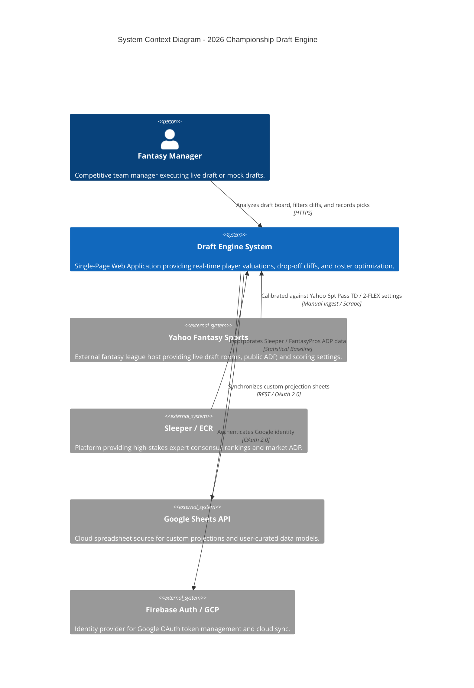
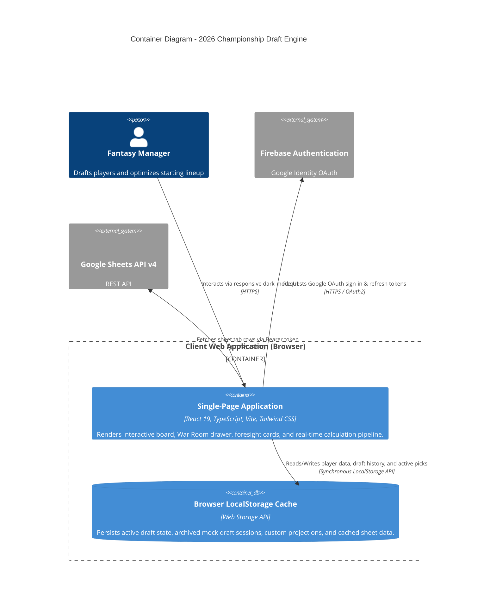
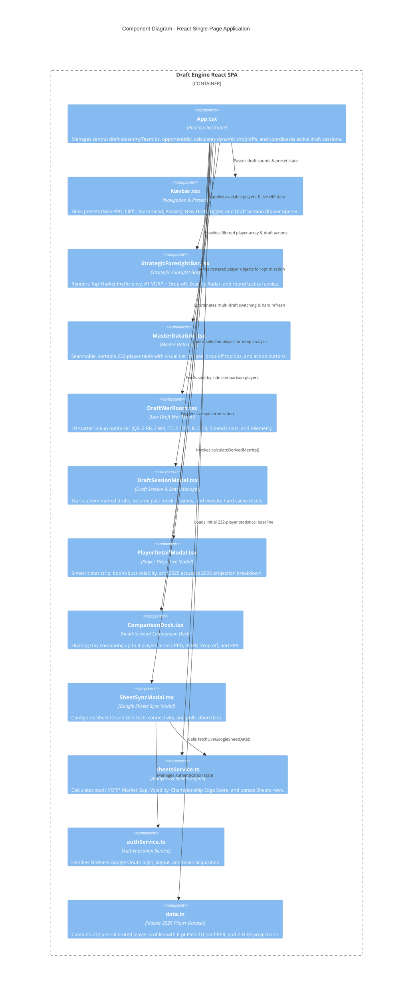

# 🏈 2026 Fantasy Football Championship Draft Engine (Agent Chaplo)

> **Real-time predictive analytics, dynamic positional scarcity cliffs, cross-platform market arbitrage, and live lineup optimization for custom competitive fantasy leagues.**

---

## 📌 1. Problem Statement

Standard fantasy football drafting tools and default league host rankings (Yahoo, ESPN, Sleeper) suffer from critical analytical flaws:

1. **Static, One-Size-Fits-All Rankings**: Default rankings fail to adjust for specific league scoring rules and starting roster requirements. In a **12-team, 0.5 PPR, 6-point Passing TD, 2-FLEX** format, quarterbacks gain massive weekly value (+9.5 PPG delta), and starting requirements expand to 7 skill positions (34 RBs and 38 WRs starting weekly across the league). Standard ADP lists completely misprice these assets.
2. **Lack of Dynamic Positional Drop-off (VONA)**: Static Value Over Replacement Player (VORP) only compares a player to an end-of-season replacement baseline. It cannot tell a manager what will happen **in the next 12 picks** if a positional run occurs. Managers frequently get trapped at the bottom of positional tiers.
3. **Cross-Platform Market Inefficiencies**: Yahoo ADP, Sleeper ADP, and Expert Consensus Rankings (ECR) exhibit severe consensus bias and lag behind true statistical indicators (such as high-value touch equity, red-zone share, and EPA per play).
4. **Draft Capital Misallocation with Short Benches**: In 5-man bench formats, drafting backup QBs or TEs too early destroys team depth. Managers need live telemetry that maximizes **weekly starting lineup PPG (140+ target)** and **90th percentile boom ceiling**.

---

## 💡 2. The Solution

The **2026 Championship Draft Engine** is an interactive, high-correlation decision-support system built to maximize weekly starting fantasy points:

- **Dual-Engine Value Model**: Combines static season-long **VORP** with real-time **Dynamic Positional Drop-off (VONA)** calculated across undrafted live players.
- **Market Arbitrage Detector**: Highlights high-leverage players whose market ADP lags their true predictive value by $+10$ to $+30$ draft spots.
- **Custom League Calibration**: Pre-calibrated for **12 Teams • Half-PPR (0.5) • 6-pt Pass TDs • 2 FLEX (10 Starters, 5 Bench)**.
- **Live Draft War Room**: 10-starter visual lineup optimizer with weekly projected PPG telemetry, ceiling modeling, and roster strength grading.
- **Strategic Foresight Radar**: Round-by-round phase recommendations, urgent tier cliff warnings, and team need intelligence.
- **Multi-Draft Session Management**: 1-click **New Draft**, **Draft Archiving & Resuming**, and **Hard Refresh Master Data Reload**.
- **Two-Way Google Sheets & Firebase Auth**: Sync custom private rankings and statistical updates seamlessly.

---

## 🚀 3. Getting Started

### Prerequisites
- **Node.js**: v18.0.0 or higher
- **npm**: v9.0.0 or higher

### Installation

1. **Clone or navigate to the repository:**
   ```bash
   cd agent-chaplo-draft-engine-2026
   ```

2. **Install project dependencies:**
   ```bash
   npm install
   ```

3. **(Optional) Configure Environment Variables:**
   If you wish to enable custom Google Sheets API sync with Firebase authentication, create a `.env.local` file in the root directory:
   ```env
   VITE_FIREBASE_API_KEY=your_firebase_api_key
   VITE_FIREBASE_AUTH_DOMAIN=your_project.firebaseapp.com
   VITE_FIREBASE_PROJECT_ID=your_project_id
   VITE_FIREBASE_STORAGE_BUCKET=your_project.appspot.com
   VITE_FIREBASE_MESSAGING_SENDER_ID=your_sender_id
   VITE_FIREBASE_APP_ID=your_app_id
   ```

4. **Start the local development server:**
   ```bash
   npm run dev
   ```
   Open your browser and navigate to: **`http://localhost:3000/`**

### Available Scripts

- `npm run dev` — Launches the Vite local dev server with Hot Module Replacement (HMR).
- `npm run build` — Typechecks with TypeScript (`tsc --noEmit`) and creates an optimized production bundle in `dist/`.
- `npm run lint` — Validates TypeScript types across all components and services.
- `npm run preview` — Locally previews the production build.

---

## 🏛️ 4. C4 Architecture Models

The application is documented below using the **C4 Software Architecture Model** across all 4 levels:

```
Level 1: System Context  -> High-level user interactions & external boundaries
Level 2: Container       -> Applications, client storage, and cloud data stores
Level 3: Component       -> Internal React components and service layers
Level 4: Code & Dataflow -> Real-time metric calculation pipeline
```

---

### Level 1: System Context Diagram
*Shows how the Fantasy Manager interacts with the Draft Engine and its surrounding platforms.*



---

### Level 2: Container Diagram
*Deconstructs the system into client application containers, local storage caching, and cloud services.*



---

### Level 3: Component Diagram
*Deconstructs the React Single Page Application into its internal presentation components, modals, and business logic services.*



---

### Level 4: Code & Dataflow Diagram
*Traces the transformation of raw player data into live drop-offs, VORP baselines, and lineup recommendations.*

```mermaid
sequenceDiagram
  autonumber
  actor User as Fantasy Manager
  participant UI as MasterDataGrid / Navbar
  participant App as App.tsx (State Orchestrator)
  participant Calc as sheetsService.ts (Algorithmic Engine)
  participant WarRoom as DraftWarRoom.tsx (Lineup Optimizer)
  participant Storage as Browser LocalStorage

  User->>UI: Selects player to draft (or marks drafted by opponent)
  UI->>App: handleDraftPlayer(player) / handleOpponentDraftPlayer(player)
  App->>Storage: Persists updated myTeamIds & opponentDraftedIds

  rect rgb(20, 24, 39)
    note over App,Calc: Real-Time Dynamic Drop-off (VONA) Calculation Pipeline
    App->>App: Filters available unpicked players: Board = All - (MyTeam + Opponents)
    App->>App: Groups available players by position (QB, RB, WR, TE, K, DEF)
    App->>App: Sorts each position by Proj_PPG_26 descending
    loop For each available player at position
      App->>App: Dynamic_Dropoff = Current_PPG - Next_Available_PPG
      App->>App: Attaches dynamicDropoff metadata (nextPlayerName, posRankAvailable, isPosLeader)
    end
  end

  rect rgb(16, 37, 28)
    note over App,WarRoom: 10-Starter Lineup Optimization & Telemetry
    App->>WarRoom: Supplies current roster (myTeamPlayers)
    WarRoom->>WarRoom: Assigns starters: 1 QB, 2 RB, 2 WR, 1 TE, 1 K, 1 DEF
    WarRoom->>WarRoom: Allocates remaining highest-PPG RBs/WRs/TEs to FLEX1 and FLEX2
    WarRoom->>WarRoom: Places remaining players in 5-man Bench
    WarRoom->>WarRoom: Computes Total Starting Proj PPG & 90th% Boom Ceiling
  end

  App->>UI: Re-renders DataGrid, Strategic Foresight Bar, and War Room with new cliffs
  UI-->>User: Displays real-time #1 cliff alert, updated VONA badges, and team need
```



---

## 📊 5. Core Mathematical Models & Formulas

### 1. Value Over Replacement Player (VORP)
Calibrated specifically for a **12-Team, 2-FLEX (10 Starters)** format:
$$\text{VORP} = \text{Proj\_Fantasy\_Pts}_{26} - \text{Baseline\_Pts}_{\text{Pos}}$$

| Position | Total League Starters | Baseline Player | Baseline Rationale |
| :--- | :--- | :--- | :--- |
| **QB** | 12 | **QB12** (Index 11) | 1 starter per team; 6-pt Pass TD magnifies upper tier delta |
| **RB** | 34 | **RB34** (Index 33) | 24 base starters ($12 \times 2$) + ~10 Flex backfield starters |
| **WR** | 38 | **WR38** (Index 37) | 24 base starters ($12 \times 2$) + ~14 Flex perimeter starters |
| **TE** | 12 | **TE12** (Index 11) | 1 starter per team; steep drop-off after Tier 1 |

---

### 2. Real-Time Dynamic Drop-off (VONA)
Measures the immediate point loss to your team if you pass on a player and take the next available option at that position:
$$\text{Dynamic Drop-off}_{\text{player}} = \text{Proj\_PPG}_{\text{player}} - \text{Proj\_PPG}_{\text{next available player at position}}$$

---

### 3. Market Gap (Arbitrage Score)
Identifies players systematically undervalued by public consensus:
$$\text{Market Gap} = \text{Average ADP} - \text{True Value Projected Rank}$$
$$\text{Average ADP} = \frac{\text{Yahoo ADP} + \text{Sleeper ADP}}{2}$$
*(A positive Market Gap of $+10.0$ or higher indicates a major draft steal).*

---

### 4. Championship Edge Score (0 – 100)
A composite algorithm weighting four dimensions of fantasy dominance:
$$\text{Edge Score} = 0.30 \cdot \text{Market Gap Score} + 0.30 \cdot \text{VORP Score} + 0.20 \cdot \text{Ceiling Score} + 0.20 \cdot \text{Red Zone Score}$$

---

## 🎯 6. League Configuration Summary

- **Teams:** 12
- **Scoring:** Half-PPR (0.5 points per reception)
- **Passing TDs:** **6 points** (dual-threat & volume passers surge by $+3.5$ to $+4.2$ PPG)
- **Starting Lineup (10 Starters):**
  - `1 QB`
  - `2 RB`
  - `2 WR`
  - `1 TE`
  - `2 FLEX` (RB / WR / TE)
  - `1 K`
  - `1 DEF`
- **Bench:** 5 Bench slots (15 total roster spots per team)
- **Weekly Target:** **140+ Projected Starting PPG** (185+ 90th percentile ceiling)

---

## 🛡️ License

Built for private competitive fantasy football draft research and dominance. All player data and statistical models reflect 2025 actual performance and 2026 predictive analytics.
